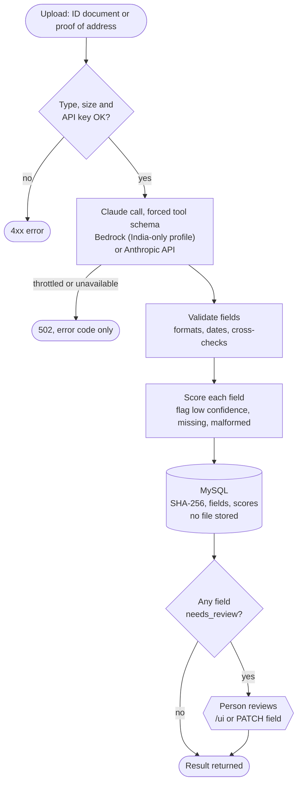
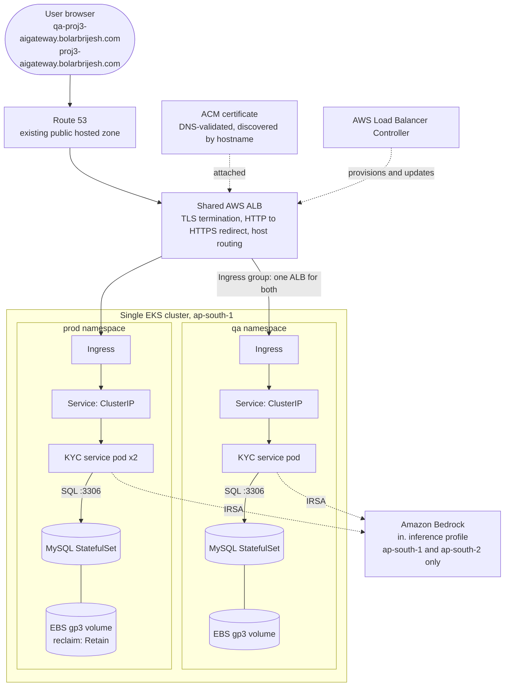
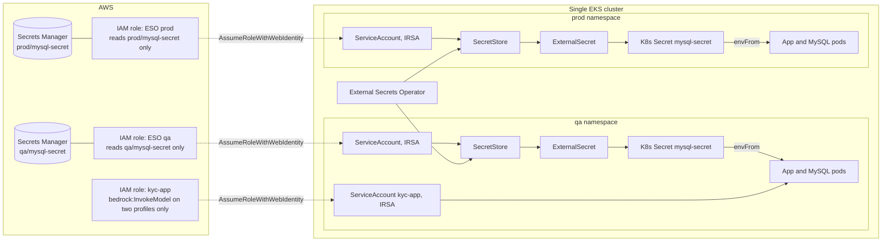
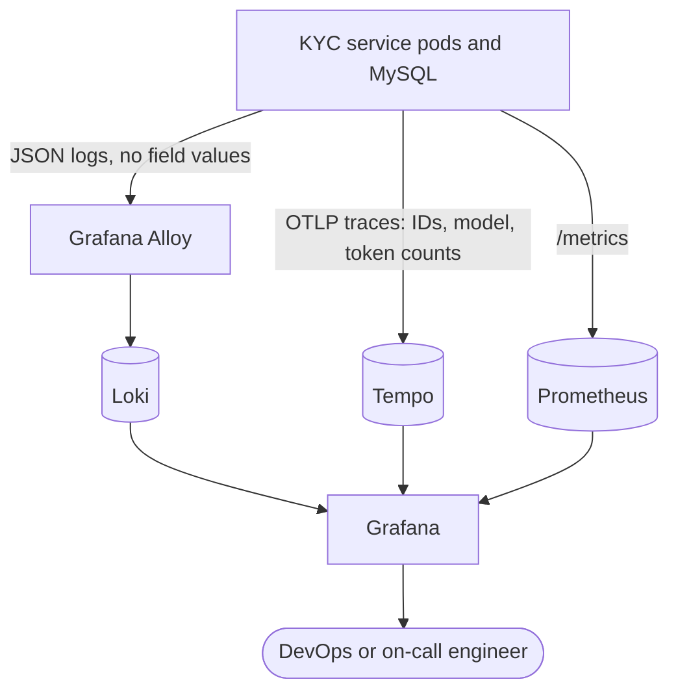
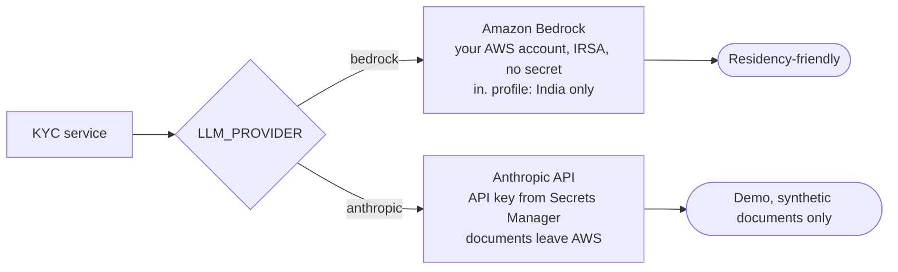
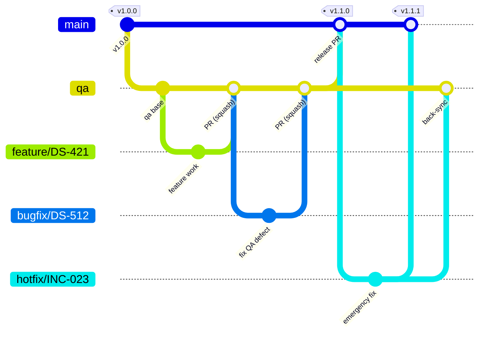
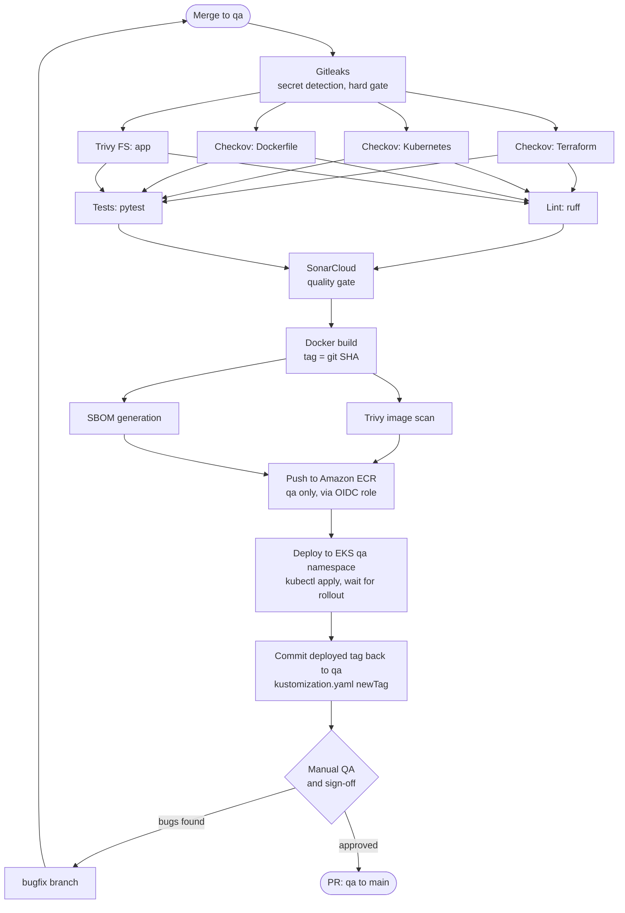
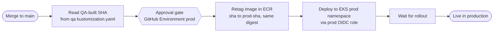
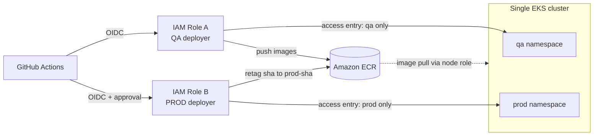
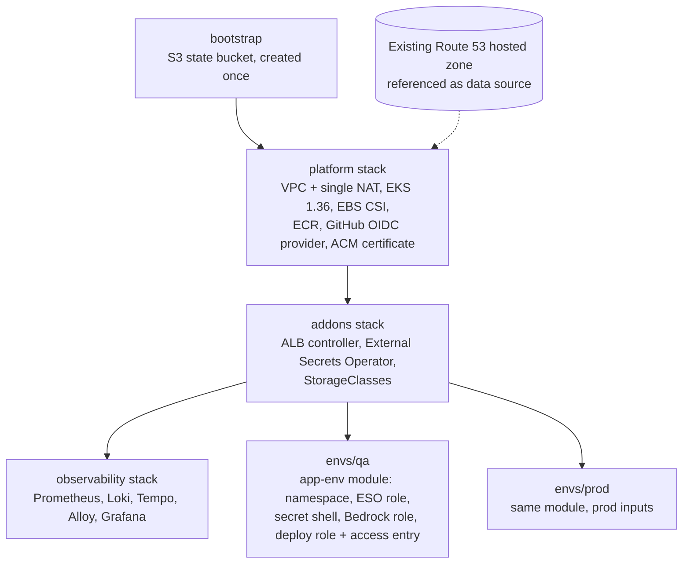

# KYC Document Intelligence on AWS EKS

A KYC document extraction service (FastAPI, Claude through Amazon Bedrock or the Anthropic API, MySQL) delivered through a **DevSecOps pipeline**: GitHub Actions with Gitleaks, Checkov, Trivy, SBOM and SonarCloud; secretless AWS access through GitHub OIDC; External Secrets and IRSA; an ALB with Route 53 and ACM; and a Prometheus, Loki, Tempo and Grafana stack. It runs on one AWS EKS cluster with approval-gated promotion from `qa` to `prod`, and it is all provisioned with Terraform.

**Contents:** [Intro](#intro) · [What it does](#what-it-does) · [Application](#application) · [Tech Stack](#tech-stack) · [Architecture](#architecture) · [Branching](#branching-strategy) · [CI/CD](#cicd-pipelines) · [Environments](#environments-and-access) · [Terraform](#infrastructure-as-code-terraform) · [Evaluation](#evaluation) · [Local development](#local-development) · [Operations](#operations) · [Model providers](#model-providers-and-data-residency) · [Known gaps and trade-offs](#known-gaps-and-trade-offs) · [Documentation](#documentation) · [Roadmap](#roadmap)

## Intro

A bank onboarding a customer has to read identity documents and proofs of address, and the same facts get re-typed by hand. This service reads the document with an LLM and returns each field with a **confidence score**. Anything low-confidence, missing or malformed is flagged, so a person checks only what needs checking.

The project has two goals, in this order:

1. **The platform and pipeline.** A production-style way to ship a service to Kubernetes: scans on every change, no static cloud credentials, secrets kept out of Git and Terraform state, one artifact promoted from QA to prod, and logs, metrics and traces from day one.
2. **A realistic workload.** The service is deliberately built to the standards a regulated workload needs: documents are never stored, personal data never reaches logs or traces, and inference stays in India.

The pipeline is deliberately app-agnostic. The workload started as a sample Node app and was swapped for this service without redesigning the pipeline; the contract any app must meet is in [CLAUDE.md](CLAUDE.md).

## What was delivered

| Requirement | Status | Where |
|---|---|---|
| KYC extraction API with per-field confidence scores | Done, verified on QA and prod | [Application](#application) |
| PII masked in logs and traces; results stored in MySQL | Done; a test reads real log output to prove no values are logged | [Application](#application) |
| Synthetic golden set and a field-accuracy evaluation | Done. Sonnet 5: 99.0% field accuracy; Haiku 4.5: 92.0% (18 synthetic documents, via the Anthropic API) | [Evaluation](#evaluation) |
| Swap into the pipeline (Dockerfile, schema, manifests, model access) | Done | [CI/CD Pipelines](#cicd-pipelines) |
| Region choice and what changes for a UAE bank | Done | [docs/data-residency.md](docs/data-residency.md) |
| Bedrock through IRSA | Built and unit-tested; **not exercised against real Bedrock** (quota is zero) | [Known gaps](#known-gaps-and-trade-offs) |

## What it does

Seven steps from upload to a reviewed record. A person is in the loop at step 6, and only for fields that were flagged.

| # | Step | What happens |
|---|---|---|
| 1 | **Upload** | `POST /documents` with an ID document or proof of address (PNG, JPEG or PDF). The file type is checked by its magic bytes, not its extension, and the size is capped. |
| 2 | **Extract** | The file is sent to Claude, through Amazon Bedrock (Converse API) or the Anthropic API, whichever `LLM_PROVIDER` selects. The model is forced to answer through one tool schema, so the output is structured fields rather than free text. |
| 3 | **Validate** | Each field is checked against its spec (formats, dates, cross-checks such as expiry after birth). Missing or malformed fields are marked. |
| 4 | **Score and flag** | Every field gets a confidence score. Below the threshold (default 0.85), missing or malformed means `needs_review`. |
| 5 | **Store** | MySQL keeps a SHA-256 hash of the upload, the extracted fields and the scores. The file itself is **never stored**. |
| 6 | **Review** | `GET /documents?needs_review=true` lists flagged documents. `PATCH /documents/{id}/fields/{name}` confirms or corrects one field. The built-in page at `/ui` does the same in a browser. |
| 7 | **Observe** | JSON logs go to Loki, traces to Tempo and metrics to Prometheus, with no personal data in any of them. |

### Document flow



There is no path that auto-corrects a field. A person confirms or edits it, and the document content never changes what the service does: the prompt tells the model to ignore any instructions found inside a document.

## Application

One container image, one Deployment per environment.

| Piece | Technology |
|-------|------------|
| Service | Python 3.12, FastAPI, SQLAlchemy, boto3 (Bedrock Converse API), the Anthropic SDK |
| Model | The deployed demo runs Claude Sonnet 5 (the more accurate of the two on the golden set); the code defaults to Haiku 4.5, the cheaper model, and the other is one setting away. On Bedrock through India-only inference profiles (`in.` prefix), inference stays in `ap-south-1` and `ap-south-2`. The demo uses the same models through the Anthropic API |
| Database | MySQL 8.0 StatefulSet (tables `documents` and `extractions`) |
| Review page | Built-in vanilla HTML and JS at `/ui`, with a strict Content Security Policy; values are rendered as text only |
| Observability | Prometheus metrics at `/metrics`, OpenTelemetry traces to Tempo, JSON logs to Loki |

**Endpoints:** `POST /documents`, `GET /documents`, `GET /documents/{id}`, `PATCH /documents/{id}/fields/{name}`, `GET /healthz`, `/metrics`, `/ui`, `/docs`.

**Key behaviours**
- **Flag, don't guess:** a field is never silently trusted. Low confidence, missing and malformed values all go to review.
- **Fail loudly and safely:** a model-provider error becomes a 502 whose message is the error code or class only, never document data. `/healthz` returns 503 when MySQL is unreachable, and the service waits up to 90 seconds for MySQL at start.
- **Optional API key:** when `KYC_API_KEY` is set, uploads and the review API require an `X-API-Key` header. It is **not enabled yet** (see Known gaps).

**Privacy by design**
- Uploaded files are processed in memory and **never stored**. Only a SHA-256 hash, the extracted fields and the scores are kept.
- Field values are never logged. A redacting filter backs that up, and a test reads the real log output to prove it. Trace spans carry only IDs, the model and token counts.
- Document content is untrusted input: the system prompt tells the model to ignore instructions inside a document, and the review page builds its DOM only with `textContent`. A test fails if `innerHTML`, `eval` or similar appears in the page script.
- AWS access is IRSA only. Each environment has a role that can invoke just the two India-only inference profiles and their underlying models.
- All test documents are synthetic and watermarked `SPECIMEN`. Never upload a real person's documents.

## Tech Stack

### Application

| Tool | What it is and why it is here |
|------|-------------------------------|
| Python 3.12, FastAPI | The API, the review page and the health and metrics endpoints |
| Amazon Bedrock (Claude Haiku 4.5, Sonnet 5) | The intended model route: reads images and PDFs and extracts fields against a schema; keyless access through IRSA |
| Anthropic API (same models) | The current demo route while the Bedrock quota is zero; needs an API key kept in Secrets Manager. Synthetic documents only |
| SQLAlchemy Core, PyMySQL | Storage for documents and extractions; the app creates its own tables at start |
| prometheus-client, OpenTelemetry | Metrics at `/metrics` and traces to Tempo |
| pytest, ruff | 49 offline tests (no AWS or MySQL needed) and linting; both run in the pipeline |

### Infrastructure and Pipeline Tooling

*Type:* **Infra** = runs or provisions the platform; **Pipeline** = used in CI/CD; **Both** = spans the two.

| Tool | What it is and the problem it solves here | Type |
|------|-------------------------------------------|------|
| GitHub and GitHub Actions | Source, branch-based promotion (`feature/*` to `qa` to `main`) and the CI/CD workflows, versioned and reviewed like code | Pipeline |
| GitHub OIDC | Workflows assume AWS IAM roles with short-lived tokens, so no static AWS keys exist in GitHub | Pipeline |
| Docker | One immutable image per commit, so the artifact tested in QA is what runs in prod | Pipeline |
| Amazon ECR | Private registry in `ap-south-1` next to EKS; SHA-tagged images and `prod-<sha>` promotions, no separate registry credentials | Both |
| Gitleaks | Scans the full history for committed secrets; the first gate | Pipeline |
| Trivy | Scans dependencies and the built image for known CVEs | Pipeline |
| Checkov | Static analysis of Terraform, Kubernetes manifests and the Dockerfile | Pipeline |
| SBOM (CycloneDX, from Trivy) | A software bill of materials for every image | Pipeline |
| SonarCloud | Static analysis with a Quality Gate on new code | Pipeline |
| kubectl and kustomize | Apply the manifests, rewrite the image name and tag at deploy time, and wait for the rollout so a failed deploy fails the job | Pipeline |
| Terraform | VPC, EKS, IAM, ECR, ACM and per-environment resources as code; remote state in S3 with native locking (`use_lockfile`) | Infra |
| AWS IAM and IRSA | Least-privilege roles for CI (separate QA and prod deployers) and for pods (External Secrets, Bedrock access) | Infra |
| Amazon VPC and NAT gateway | Public and private subnets; one NAT gateway as a cost decision | Infra |
| Amazon EKS and Kubernetes | Managed control plane, two `t3a.large` nodes, namespaces `qa` and `prod` | Infra |
| Helm | Installs the cluster add-ons: ALB controller, External Secrets Operator, kube-prometheus-stack, Loki, Tempo, Alloy | Infra |
| AWS Load Balancer Controller and ALB | Turns Ingress resources into one shared, internet-facing ALB that terminates TLS and routes by host | Infra |
| Amazon Route 53 | An existing hosted zone is reused; one manual alias record per hostname points at the shared ALB | Infra |
| AWS Certificate Manager | Free, auto-renewing certificate validated through DNS; the ALB controller finds it by hostname | Infra |
| Amazon EBS and CSI driver | Persistent gp3 volumes for MySQL and the observability stack | Infra |
| AWS Secrets Manager and External Secrets Operator | Credentials stay out of Git and Terraform state; each environment's role can read only its own secret | Infra |
| Prometheus and Alertmanager | Cluster and app metrics (kube-prometheus-stack) | Infra |
| Loki and Grafana Alloy | Log storage (15 days) and the collector that ships every pod's logs; Alloy replaces the end-of-life Promtail | Infra |
| Tempo and OpenTelemetry | Distributed tracing: the app emits OTLP, Tempo stores it | Infra |
| Grafana | One place for metrics, logs and traces, reached with `kubectl port-forward` | Infra |
| AWS CloudTrail | Audit log of role assumptions and API calls, including pipeline deployments | Infra |

Deliberately not used: Semgrep, cosign image signing and Kyverno policy enforcement. They are optional hardening and are left out to keep the pipeline simple.

## Architecture

### Request flow and workloads

One EKS cluster, one shared ALB, two environment namespaces.



### Secrets management

External Secrets Operator runs once per cluster. Each environment namespace has its own service account, IAM role and secret: the QA role can read only `qa/mysql-secret`, and the prod role only `prod/mysql-secret`.



Terraform creates the secret shell and the IAM roles but never the password values, which are set out-of-band so they never land in Terraform state. **Secret values are write-once:** MySQL reads its passwords only on first start, so overwriting a value later breaks the next app pod. The recovery and rotation procedures are in the [runbook](docs/runbook.md#secrets). Images are pulled from ECR using the node group's IAM role, so no image pull secret exists.

### Observability



Prometheus does not scrape `/metrics` yet because no ServiceMonitor exists (see Known gaps).

### Using Grafana

Grafana is deliberately not exposed to the internet. You reach it from your own machine through a port-forward, which tunnels
`localhost` to the Grafana pod in the cluster. You need `kubectl` pointed at the cluster
(`aws eks update-kubeconfig --name devsecops-eks --region ap-south-1` once) and your AWS credentials set.

**1. Get the admin password.** The chart generates a random one when it is installed. It is stored only in the cluster
(never in Terraform or Git), so read it from the Kubernetes Secret:

```bash
kubectl get secret kube-prometheus-stack-grafana -n monitoring -o jsonpath='{.data.admin-password}' | base64 -d; echo
```

**2. Open the tunnel.** Leave this running in its own terminal (stop it with Ctrl+C):

```bash
kubectl port-forward -n monitoring svc/kube-prometheus-stack-grafana 3000:80
```

If port 3000 is already in use, pick another local port, for example `3001:80`, and browse to that port instead.

**3. Log in.** Browse to <http://localhost:3000>. Username `admin`, password from step 1.

**4. Where to look**

| What | Where in Grafana | Try |
|------|------------------|-----|
| Logs (Loki) | Explore, data source **Loki** | `{namespace="qa"}` or `{namespace="prod", app="nodejs-app"}`. Add `\|= "error"` to filter. |
| Metrics (Prometheus) | Explore, data source **Prometheus** | `sum by (namespace) (container_memory_working_set_bytes)` |
| Dashboards | Dashboards, then browse | **Kubernetes / Compute Resources / Namespace (Pods)** (pick `qa` or `prod`), **Kubernetes / Compute Resources / Cluster**, **Node Exporter / Nodes** |
| Traces (Tempo) | Explore, data source **Tempo** | Search by service `kyc-document-intelligence`. Each upload shows the HTTP request and the Bedrock call (model, tokens, latency; no personal data). |

Retention is 15 days for logs, metrics and traces. Data lives on `gp3` volumes, so it survives pod restarts and node replacement. The
volumes were created on `ebs-sc-retain`, then their reclaim policy was patched to `Delete`, so destroying the stack also removes them.

**Other consoles (optional)**, each in its own terminal:

```bash
kubectl port-forward -n monitoring svc/kube-prometheus-stack-prometheus 9090:9090     # Prometheus: http://localhost:9090
kubectl port-forward -n monitoring svc/kube-prometheus-stack-alertmanager 9093:9093   # Alertmanager: http://localhost:9093
```

**If you forget or want to change the password.** Reading the Secret (step 1) always shows the current generated password.
To set your own, run the following once. It changes it inside Grafana's database; the Secret keeps showing the original
generated value, so note the new one yourself:

```bash
kubectl exec -n monitoring deploy/kube-prometheus-stack-grafana -c grafana -- grafana cli admin reset-admin-password '<new-password>'
```

**If a page is empty or the login fails:**
- Check the pods are running: `kubectl get pods -n monitoring` (everything should be `Running`).
- Logs missing: `kubectl logs -n monitoring deploy/alloy -c alloy --tail=50` should show no `level=error` lines.
- Password rejected: re-read it from the Secret; do not trust an old copy, because reinstalling the chart can generate a new one.

## Model providers and data residency

The service talks to Claude through one of two providers, chosen by `LLM_PROVIDER`. Both use the same prompt, the same forced tool schema and the same scoring, so their results are comparable.



- **The demo runs on `anthropic`.** This AWS account's Bedrock quota is zero and could not be raised in time, so the deployed environments call the Anthropic API.
- **A bank that needs data residency switches to `bedrock`.** It is a one-line manifest change: the IAM role, the India-only inference profiles and the Terraform for them are already in place. In a UAE deployment the Region would be `me-central-1`, with the caveats about inference routing in [docs/data-residency.md](docs/data-residency.md).
- **The service is protected by an API key** (`X-API-Key`), because a working model key means every upload costs money. The pod will not start without it.
- **Never upload a real document while `anthropic` is selected.**

## Branching Strategy



| Branch | Created from | Merged into | Environment |
|--------|--------------|-------------|-------------|
| `main` | permanent | n/a | Production |
| `qa` | `main` | `main` | QA |
| `feature/*` | `qa` | `qa` | pre-merge |
| `bugfix/*` | `qa` | `qa` | QA |
| `hotfix/*` | `main` | `main` + `qa` | Production (emergency) |

Naming: `<type>/<ticket-id>-<short-slug>` in lowercase with hyphens; releases are tagged `vMAJOR.MINOR.PATCH`.

## CI/CD Pipelines

### QA pipeline (on merge to `qa`)



### Production pipeline (on merge to `main`)

Continuous delivery only: nothing is rebuilt, rescanned or retested.



The approval screen shows exactly which QA image is being promoted. The prod role can only retag in ECR and deploy to the `prod` namespace.

Images live in a private ECR repository in the same region as EKS. QA builds are tagged with the git SHA; promotion retags the same image as `prod-<sha>`, so prod runs the exact bytes that passed QA.

Principles: security at every stage, **build once and promote the artifact**, immutable SHA-tagged images (never `latest`), parallel jobs for speed, human-approved promotion to prod.

## Environments and Access

Two environments, `qa` and `prod`, run as separate namespaces on a single EKS cluster to keep costs down. Isolation comes from namespaces, resource quotas and separate IAM deployer roles, each mapped to its own namespace through EKS access entries. All resources live in `ap-south-1`. Disaster recovery is provisioned on demand from the Terraform code rather than kept running.



The QA and prod pipelines never share an IAM role, and the QA role has no permissions on the `prod` namespace. Because both environments share one cluster, they also share the control plane and nodes. If stronger isolation is needed later, prod can move to its own cluster without changing the pipeline design.

## Infrastructure as Code (Terraform)

AWS resources, cluster add-ons and namespaces are provisioned with Terraform. The application manifests in `k8-manifests/` are deployed by the pipeline. QA is built first, and prod reuses the same environment module with different inputs.



Each stack has its own remote state in S3 with native locking, so qa and prod can be applied or destroyed independently of each other and of the shared platform. `terraform destroy` only removes what Terraform created. The hosted zone is a data source and is never touched. The build order and what each stack creates are in [terraform/README.md](terraform/README.md); pause and resume, secret rotation and destroy safety are in the [runbook](docs/runbook.md); what the infrastructure looks like is in [eks-explained](docs/eks-explained.md).

### Manual DNS step (one-time per hostname)

The ALB is created by the AWS Load Balancer Controller when the first Ingress is applied, so its address is only known after the first deploy. After that:

1. Find the ALB DNS name: `kubectl get ingress -n qa` (the `ADDRESS` column; the shared ALB serves both environments).
2. In the Route 53 hosted zone for `bolarbrijesh.com`, create an **A record with Alias enabled** for each hostname (`qa-proj3-aigateway.bolarbrijesh.com`, `proj3-aigateway.bolarbrijesh.com`), pointing at that ALB (region `ap-south-1`).

The ALB keeps its address as long as the Ingress group exists. If the ALB is deleted and recreated, update the alias records.

## Extending to More Environments (dev, ppd)

Only `qa` and `prod` are in scope today. The pipelines are driven by per-environment configuration, so adding `dev` or `ppd` does not require restructuring:

1. **Namespace and manifests:** copy `k8-manifests/qa/` to `k8-manifests/<env>/` and adjust namespace, replicas, resources and host. The shared ALB group and certificate discovery mean no per-environment ALB or certificate ARN is needed, as long as the ACM certificate covers the new hostname.
2. **Environment config:** add the environment's values (namespace, cluster name, IAM role ARN, host, ECR repo) as GitHub Environment variables or a workflow matrix entry instead of hardcoding them.
3. **Branch mapping:** decide which branch deploys to it and add that trigger to the workflow.
4. **AWS access:** instantiate the `app-env` module for the new environment. Never give a non-prod role access to `prod`.
5. **Secrets:** each environment gets its own Secrets Manager entry (`<env>/mysql-secret`) through that module.
6. **DNS and TLS:** add the hostname to the ACM certificate's SANs and create a one-time alias record to the shared ALB.
7. **Approvals:** add a GitHub Environment with required reviewers if the environment should be gated.

## Evaluation

Accuracy is measured on a **golden set of 18 synthetic, watermarked SPECIMEN documents**: 10 ID cards and 8 proofs of address, some degraded and some as PDFs, generated from a fixed seed and committed in `app/eval/golden/` with their labels. The runner sends each one through the real extraction code and reports, per model (Haiku 4.5 and Sonnet 5):

- **Field accuracy** and **document accuracy** (all fields right)
- **Accuracy of fields passed without review**: how right the unflagged fields are
- **Wrong fields caught by the review flag**: the rate at which mistakes were flagged
- Breakdowns by difficulty, document type and field, plus latency and token counts

**Results** (18 documents, 100 fields, review threshold 0.85, measured through the **Anthropic API**; the full tables are in [app/eval/results/RESULTS.md](app/eval/results/RESULTS.md)):

| Metric | Haiku 4.5 | Sonnet 5 |
|---|---|---|
| Field accuracy | 92.0% | **99.0%** |
| Document accuracy (all fields right) | 55.6% | **94.4%** |
| Wrong fields | 8 | 1 |
| Wrong fields caught by the review flag | 0% | 0% |
| Fields sent to review | 0% | 0% |
| Average latency | 2.5 s | 2.6 s |
| Tokens in / out | 43,404 / 3,925 | 51,160 / 3,938 |

What the numbers say, and what they do not:

- **Sonnet 5 is clearly more accurate at about the same latency.** Haiku's errors cluster in two fields: `issuing_country` (50%) and `address_line` (75%). In six of its eight errors it changed the spelling of an invented country name (for example `EXAMPLIA` read as `EXEMPLIA`), the kind of mistake a model makes when it "corrects" a word it does not recognize. Both models dropped a trailing house number from one address. Real country names would probably not trigger the spelling errors, so treat the Haiku figure as a pessimistic one.
- **The review flag did not work on this set.** No field was sent to review, so none of the nine wrong fields (8 and 1) was caught. Every field came back with a self-reported confidence of 0.90 or higher, including the wrong ones (some at 0.95 to 1.0), so a threshold of 0.85 never fires and the model's confidence does not separate right from wrong here. This is the most important finding: self-reported confidence alone is not a safe review trigger. Realistic fixes are other signals (agreement between two models, checks against a known list of issuers or countries, stricter format rules) rather than just a higher threshold. This is listed under Known gaps.
- **18 documents is a smoke test, not a benchmark.** The figures carry wide error bars, the documents are synthetic and clean, and nothing here predicts accuracy on real customer documents.

To reproduce (the Anthropic route needs a key in `ANTHROPIC_API_KEY`; with Bedrock, drop `--provider anthropic`):

```bash
cd app && .venv/bin/python -m eval.run --provider anthropic --models haiku --limit 1   # one document first
.venv/bin/python -m eval.run --provider anthropic                                      # then the full comparison
```

Details are in [app/eval/README.md](app/eval/README.md).

## Repository Layout

```
CLAUDE.md                Rules, decisions and the app contract for Claude Code
app/
  kyc/                   FastAPI service (extraction, validation, storage, PII-safe logging, review page)
  tests/                 pytest suite (no AWS or MySQL needed)
  eval/                  Golden set generator, scoring and the Haiku vs Sonnet accuracy runner
docs/                    Runbook, troubleshooting, decision log, security gates, EKS explained
Dockerfile               Multi-stage Python image; non-root (UID 10001), port 5000
sonar-project.properties SonarCloud project config
k8-manifests/
  qa/                    App, MySQL, SecretStore and ExternalSecret, Ingress (qa namespace), kustomization.yaml
  prod/                  Same for the prod namespace (2 replicas, retained storage)
.github/workflows/       QA and prod pipelines (GitHub Actions)
terraform/               AWS infrastructure (see terraform/README.md)
  bootstrap/             S3 state bucket
  platform/              VPC, EKS, ECR, OIDC provider, ACM certificate
  addons/                ALB controller, ESO, StorageClasses
  observability/         Prometheus, Loki, Tempo, Alloy, Grafana
  modules/app-env/       Per-environment module: namespace, quota, secret shell, ESO and Bedrock roles, deploy role
  envs/qa, envs/prod/    Environment instantiations
```

## Local Development

Run the tests and the linter (no AWS or MySQL needed):

```bash
cd app && python3 -m venv .venv && .venv/bin/pip install -r requirements-dev.txt
.venv/bin/python -m pytest && .venv/bin/ruff check .
```

Run the service against real Bedrock with a local SQLite database (needs AWS credentials with Bedrock access and a quota for the model):

```bash
KYC_DATABASE_URL="sqlite+pysqlite:///kyc-local.db" AWS_REGION=ap-south-1 \
  .venv/bin/uvicorn kyc.main:get_app --factory --port 5000
```

Then open <http://localhost:5000/ui> (or `/docs`). Use the synthetic documents in `app/eval/golden/` and never real personal documents.

Settings (environment variables): `PORT`, `AWS_REGION`, `BEDROCK_MODEL_ID` (default `in.anthropic.claude-haiku-4-5-20251001-v1:0`), `CONFIDENCE_THRESHOLD` (0.85), `MAX_UPLOAD_BYTES`, `DB_HOST`, `DB_NAME`, `DB_USER`, `DB_PASSWORD` (or `KYC_DATABASE_URL`), `KYC_API_KEY` (optional locally, required in the cluster), `LLM_PROVIDER` (`bedrock` or `anthropic`), `ANTHROPIC_API_KEY` and `ANTHROPIC_MODEL` (default `claude-haiku-4-5`) for the Anthropic provider, `OTEL_EXPORTER_OTLP_ENDPOINT` (optional), `LOG_LEVEL`.

Container image:

```bash
docker build -t nodejs-app .
```

The image, ECR repository and Deployment are still named `nodejs-app`, from the sample app this service replaced, so the pipeline needed no changes.

## Prerequisites

- **To develop:** Python 3.12 and Docker.
- **For live extraction:** either an AWS account with Amazon Bedrock access to Claude Haiku 4.5 and a non-zero quota, or an Anthropic API key with prepaid credit (see Known gaps).
- **To deploy:** an AWS account (region `ap-south-1`) and credentials to apply the Terraform stacks once, a registered domain with a Route 53 hosted zone, a GitHub repository with Actions, a SonarCloud project, Terraform 1.10 or later, `kubectl` and the AWS CLI. After the first apply, the pipeline uses OIDC only.

## Known gaps and trade-offs

Two kinds of limitation, kept apart on purpose:

- **Gap:** something that is missing or unfinished and should exist before this is used for real. Each has a plan.
- **Trade-off:** a deliberate choice that gives something up (usually cost or simplicity) and that I would defend today. Each says what would make me change it.

The reasoning behind the trade-offs is in the [decision log](docs/decisions.md).

| Item | Type | What it means | Plan or trigger to revisit |
|---|---|---|---|
| **Bedrock quota is zero** | Gap | Bedrock cannot be used in this account yet, so the demo uses the Anthropic API. Every Bedrock rate quota I checked (all vendors) is 0, at the minimum the console lets you request | Raise through AWS Support, then set `LLM_PROVIDER=bedrock` |
| **The review flag does not catch errors** | Gap | On the golden set every field had self-reported confidence of 0.90 or more, so nothing was flagged and none of the nine wrong fields was caught ([Evaluation](#evaluation)) | Add independent signals (second-model agreement, known-value checks) instead of relying on confidence |
| **Bedrock route not exercised end to end** | Gap | The IAM role, profiles and code path exist and are unit-tested, but have not run against real Bedrock here | Verify after the quota arrives |
| **Demo sends documents to the Anthropic API** | Trade-off | Documents leave AWS and India for the demo. Acceptable only with synthetic documents; real data needs Bedrock ([docs/data-residency.md](docs/data-residency.md)) | Switch to `bedrock` |
| **No NetworkPolicies or PodDisruptionBudgets** | Gap | Any pod can reach any other pod, and a node drain can take all replicas down | Test a default-deny policy in QA first ([security-gates.md](docs/security-gates.md)) |
| **No `/metrics` scraping or alert receivers** | Gap | The service exposes metrics, but Prometheus does not collect them, and Alertmanager notifies nobody | Add a ServiceMonitor and a receiver |
| **Cluster CPU headroom is thin** | Gap | Two `t3a.large` nodes carry two projects plus observability. The QA MySQL disk is pinned to one zone, and after a restart it could not be scheduled because that node was 90% full on CPU requests ([troubleshooting](docs/troubleshooting.md#mysql-0-stays-pending-after-a-restart)) | Trim requests or add a third node |
| **Rollback not rehearsed** | Gap | The procedure is documented in the [runbook](docs/runbook.md#roll-back) but has not been exercised | Try it once in QA |
| **One cluster, one ALB, one NAT gateway** | Trade-off | `qa` and `prod` share a control plane, nodes and blast radius; isolation is IAM, namespaces and quotas. Saves roughly the cost of a second cluster | Real production traffic or a hard-isolation requirement |
| **Public EKS API endpoint** | Trade-off | GitHub-hosted runners have no fixed IPs, so the API is open to the internet and protected by IAM | Self-hosted runners with fixed IPs |
| **`qa` branch protection is light** | Trade-off | Force-push and deletion are blocked, but PRs cannot be required because the pipeline's bot pushes the deployed tag to `qa` | A ruleset that lets the `github-actions` app bypass |
| **Scanners block, with suppressions and `--ignore-unfixed`** | Trade-off | Accepted findings are suppressed with a written reason, and CVEs with no available fix do not block | Reviewed with [security-gates.md](docs/security-gates.md) |
| **No Semgrep, cosign or Kyverno** | Trade-off | Optional hardening skipped to keep the pipeline simple; images are not signed | Supply-chain requirements |
| **`X-API-Key` is one shared secret** | Trade-off | Simple and enough for a demo, but there are no per-user identities, scopes or an audit trail of who called what | SSO or per-client keys for real use |
| **Uploaded files are never stored** | Trade-off | Minimal data held, but a document cannot be re-processed later | A re-processing requirement |
| **Single-instance Loki and Tempo on EBS, 15 days** | Trade-off | One pod failure means a gap in logs or traces; no S3 backend | Longer retention or higher availability needs |
| **Manual DNS aliases and manual Terraform apply** | Trade-off | Fewer moving parts for two hostnames and rare changes | More hostnames or more contributors |
| **Docs-only changes skip the pipeline** | Trade-off | A secret committed in a Markdown-only change is caught only by the next full run | Revisit if the repo gets more contributors |
| **Image and ECR repository still named `nodejs-app`** | Trade-off | A misleading name, kept so the swap changed no pipeline or Terraform | A deliberate rename PR |

## Operations

The hostnames below answer only while the cluster is running (it is paused or destroyed between demos). Each environment has its own `X-API-Key`.

| Environment | Hostname | Notes |
|---|---|---|
| QA | `qa-proj3-aigateway.bolarbrijesh.com` | `/ui` is the review page, `/healthz` the health check |
| Prod | `proj3-aigateway.bolarbrijesh.com` | **No `prod-` prefix** |

The step-by-step procedures are in the [runbook](docs/runbook.md). In short:

- **Release:** merge a feature PR into `qa` (it deploys to the QA namespace), check `/healthz` and `/ui`, then open a PR from `qa` to `main` with a merge commit. The prod pipeline pauses for your approval and shows which image it will promote.
- **Pause to save cost:** scale the node group to zero; resume the same way. Pausing saves the nodes only, roughly a third of the running cost.
- **Secrets:** set once per environment and never overwritten; the recovery and rotation steps are in the runbook.
- **Something broke:** start from the symptom table in [troubleshooting](docs/troubleshooting.md).
- **A scanner blocked a merge:** see [security-gates.md](docs/security-gates.md).

## Documentation

| Document | Contents |
|---|---|
| [docs/README.md](docs/README.md) | Index of all documentation |
| [terraform/README.md](terraform/README.md) | The stacks, what each creates, the build order and conventions |
| [docs/runbook.md](docs/runbook.md) | Release, promote, roll back, pause and resume, secrets, destroy |
| [docs/troubleshooting.md](docs/troubleshooting.md) | Symptoms, causes and fixes for problems this project has hit |
| [docs/security-gates.md](docs/security-gates.md) | What blocks the pipeline, every suppression and how to turn gates on or off |
| [docs/decisions.md](docs/decisions.md) | Why each choice was made and what it costs |
| [docs/data-residency.md](docs/data-residency.md) | The model-provider switch and what changes for a bank with residency requirements |
| [docs/eks-explained.md](docs/eks-explained.md) | Kubernetes and EKS concepts, with diagrams of what runs where |
| [app/eval/README.md](app/eval/README.md) | The accuracy evaluation |
| [CLAUDE.md](CLAUDE.md) | Rules and the app contract for AI coding assistants |

## Roadmap

| Step | Scope | Status |
|------|-------|--------|
| Platform | EKS, ALB, ACM, secrets, QA and prod pipelines, observability | done, live |
| KYC service | Extraction API, per-field confidence, PII-safe logs and traces, review page | done, deployed |
| Provider switch | `LLM_PROVIDER`: Anthropic API for the demo, Bedrock for residency | done |
| API key | `<env>/kyc-api-key` secret, ExternalSecret and a required env var | done |
| Residency note | Provider switch and what changes for a UAE bank ([docs/data-residency.md](docs/data-residency.md)) | done |
| End-to-end verification | Synthetic ID and proof-of-address uploads on QA and prod | done |
| Accuracy evaluation | Run on both models through the Anthropic API; results committed | done |
| Review-flag reliability | Replace confidence-only flagging with independent signals | open |
| Bedrock verification | Switch `LLM_PROVIDER` to `bedrock` and re-test | waiting on AWS quota |
| Branch protection | Rulesets on `qa` and `main`, GitHub Environment `prod` with a required reviewer | done |
| Scanner enforcement | Checkov, Trivy and the Sonar gate block the pipeline ([docs/security-gates.md](docs/security-gates.md)) | done |
| Hardening | NetworkPolicies, ServiceMonitor, alert receivers, PodDisruptionBudgets | deferred |
