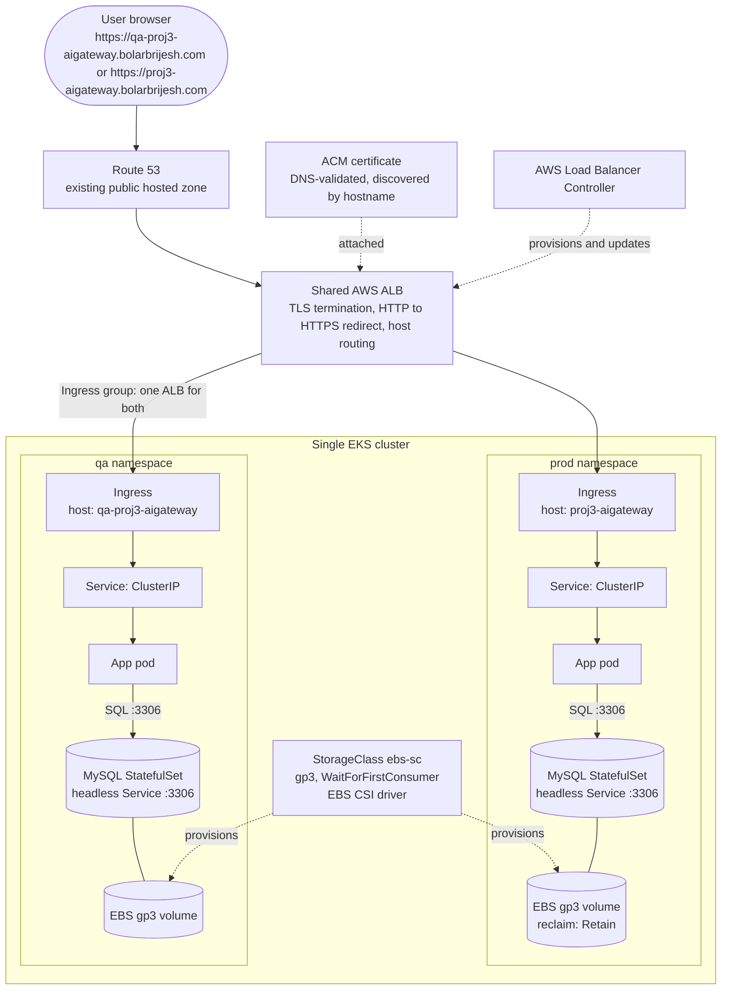
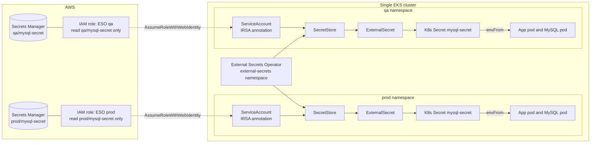
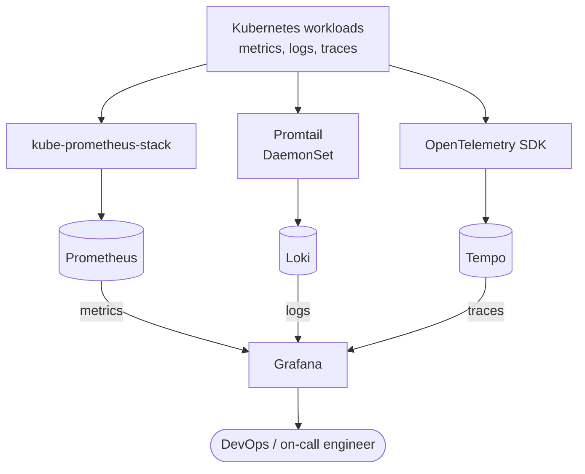
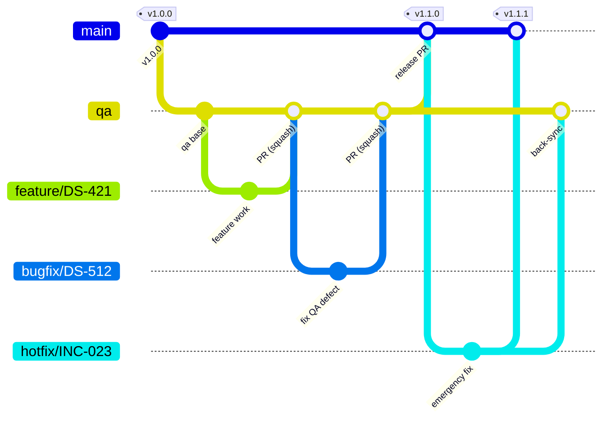
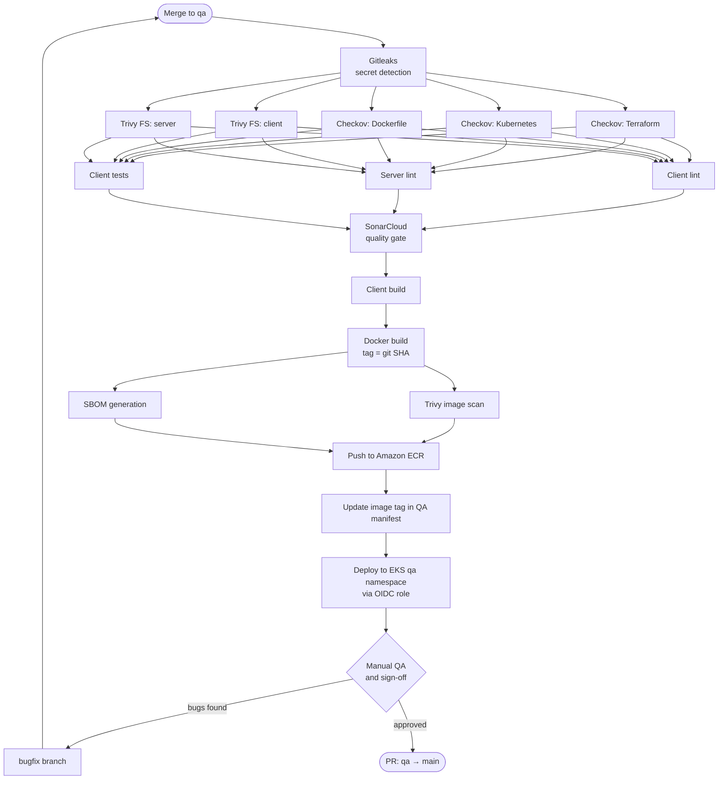
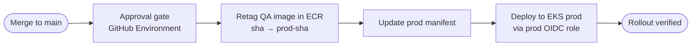
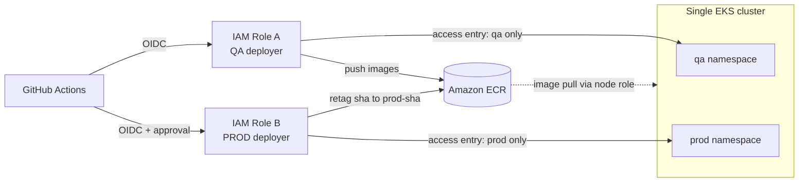
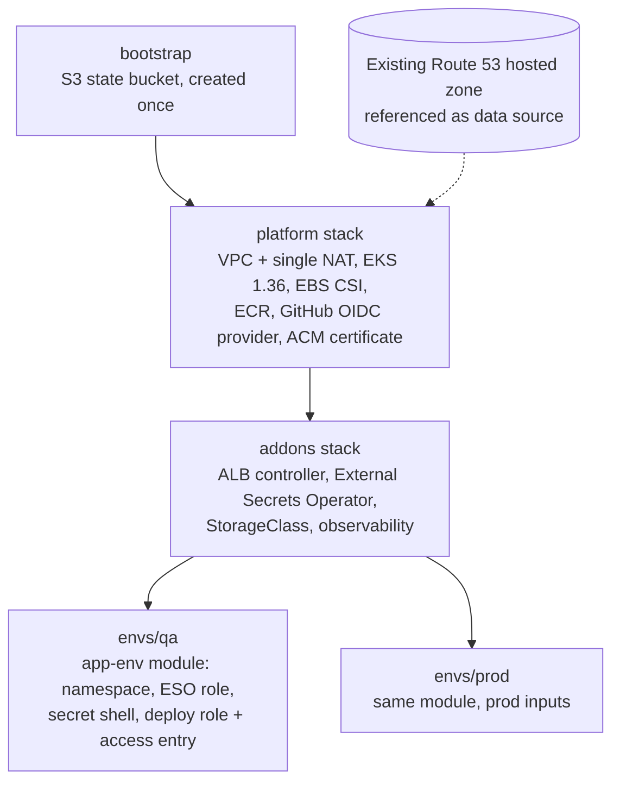

# End-to-End DevSecOps on AWS EKS

A production-grade DevSecOps project: a 3-tier Node.js application deployed to **AWS EKS** via **GitHub Actions**, with security scanning built into every pipeline, secretless AWS authentication, managed secrets, HTTPS routing, and full observability.

> **Status:** Application code and initial Kubernetes manifests are in place. CI/CD workflows, infrastructure code, MySQL manifests, secrets integration and observability are still to be built.

## What You'll Build

- End-to-end CI/CD with GitHub Actions and branch-based promotion: `feature/*` → `qa` → `main`
- DevSecOps tooling in the pipelines: **Gitleaks**, **Trivy**, **Checkov**, **SBOM**, **SonarCloud**
- Secretless AWS auth via **GitHub OIDC** (no static credentials) with secure EKS access
- Secrets management with **AWS Secrets Manager**, **External Secrets Operator**, and **IRSA**
- Stateful **MySQL** on Kubernetes using StatefulSets, Services, and persistent EBS storage
- Production-grade **EKS** architecture with **ALB**, **Route 53**, and **ACM** for HTTPS
- Observability with **Prometheus, Loki, Tempo, and Grafana** (metrics, logs, traces)
- Custom domain with ACM-issued TLS certificates wired into the Kubernetes Ingress

## Application and Tech Stack

### Application

A simple User Management app (Add / View / Edit / Delete users) serves as a placeholder workload to exercise the platform. It will later be replaced by an AI-based project (TBD), so the pipelines and manifests are designed to stay app-agnostic.

| Tier | Technology |
|------|------------|
| Frontend | React 17, Webpack 5, Axios |
| Backend | Node.js 20, Express 4, `mysql2` (REST API, port 5000) |
| Database | MySQL 8.0 |

API: `GET /api/users`, `POST /api/users`, `PUT /api/users/:id`, `DELETE /api/users/:id`.

### Infrastructure and Pipeline Tooling

*Type:* **Infra** = runs or provisions the platform; **Pipeline** = used in CI/CD; **Both** = spans the two.

| Tool | What it is and the problem it solves here | Type |
|------|-------------------------------------------|------|
| GitHub | Hosts the code, enforces branch protection and PR reviews, and provides the branch-based promotion gates (`feature/*` → `qa` → `main`). | Pipeline |
| GitHub Actions | CI/CD engine defined as YAML in the repo. Runs the QA and prod workflows, so pipeline changes are versioned and reviewed like code. | Pipeline |
| GitHub OIDC | Lets workflows assume AWS IAM roles with short-lived tokens. Removes static AWS keys from GitHub secrets. | Pipeline |
| Docker | Packages the app into an immutable container image so the exact artifact tested in QA is what runs in prod. | Pipeline |
| Amazon ECR | Private image registry in `ap-south-1`. Stores SHA-tagged images and `prod-<sha>` promotions next to EKS, with IAM-based access and no separate registry credentials. | Both |
| Gitleaks | Scans the repository history for committed secrets. First pipeline gate, so a leaked credential stops the build immediately. | Pipeline |
| Trivy | Scans dependencies (filesystem) and the built image for known CVEs. Blocks High/Critical findings before anything is pushed or deployed. | Pipeline |
| Checkov | Static analysis of Terraform, Kubernetes manifests and the Dockerfile. Catches misconfigurations (root containers, open security groups, missing limits) before they are provisioned. | Pipeline |
| SBOM (CycloneDX, generated by Trivy) | Produces a software bill of materials for every image. Gives an auditable inventory of dependencies for supply-chain and vulnerability tracking. | Pipeline |
| SonarQube Cloud (SonarCloud) | Static code analysis for bugs, vulnerabilities, code smells and duplication, with a Quality Gate on new code that can fail the pipeline. Hosted, so there is no server to run. | Pipeline |
| ESLint | Linting for client and server code. Fast, cheap enforcement of style and common errors. | Pipeline |
| kubectl | CLI used by the pipeline to apply manifests and wait for rollouts (`rollout status`) so a failed deploy fails the job. | Pipeline |
| Terraform | Infrastructure as code for VPC, EKS, IAM, ECR, Route 53 and more. Makes infrastructure repeatable, reviewable and scannable, and enables on-demand disaster recovery. | Infra |
| Amazon S3 (Terraform remote state) | Stores Terraform state remotely with versioning and encryption, and native S3 state locking (`use_lockfile`) so concurrent runs cannot corrupt state. Keeps state out of Git and shared between local runs and the pipeline. | Infra |
| AWS | Cloud platform hosting everything in this project. | Infra |
| AWS IAM and IRSA | Least-privilege roles for CI (separate QA and prod deployers) and for pods (for example External Secrets Operator) via service-account-to-role binding. | Infra |
| Amazon VPC and NAT gateway | Network isolation: public and private subnets, routing and security groups. A single NAT gateway gives private-subnet nodes outbound access (image pulls, AWS APIs) at lower cost than one per AZ. | Infra |
| Amazon EKS | Managed Kubernetes control plane; AWS runs the API server and etcd, we manage node groups and workloads. | Infra |
| Kubernetes | Orchestrates the app and database: Deployments, Services, Ingress, StatefulSets, namespaces and rolling updates for zero-downtime releases. | Infra |
| Helm | Installs and versions cluster add-ons (AWS Load Balancer Controller, External Secrets Operator, kube-prometheus-stack, Loki, Tempo). | Infra |
| AWS Load Balancer Controller and ALB | Turns Kubernetes Ingress resources into an internet-facing Application Load Balancer that terminates TLS and routes by host and path. An Ingress group shares one ALB between `qa` and `prod` to save cost. | Infra |
| Amazon Route 53 | DNS for the custom domain. An existing public hosted zone is reused (not created by Terraform); a one-time alias record per environment hostname points at the shared ALB (alias records to AWS resources cost nothing). | Infra |
| AWS Certificate Manager (ACM) | Free, auto-renewing TLS certificate validated through DNS in the Route 53 zone. The ALB controller discovers it by hostname, so no certificate ARN is hardcoded in manifests. | Infra |
| Amazon EBS and CSI driver | Persistent gp3 volumes for MySQL, provisioned by the EBS CSI driver add-on, so data survives pod restarts and rescheduling. | Infra |
| MySQL (StatefulSet) | Stateful database with stable identity and storage, run on Kubernetes. | Infra |
| AWS Secrets Manager | Central, encrypted store for database credentials so they are never committed or hand-created in the cluster. | Infra |
| External Secrets Operator | Syncs Secrets Manager values into Kubernetes Secrets using IRSA, with a separate service account and IAM role per environment namespace. Keeps secrets out of Git. | Infra |
| Prometheus and Alertmanager | Collect cluster and app metrics and route alerts (CPU, memory, restarts, error rate). Installed through kube-prometheus-stack. | Infra |
| Loki and Promtail | Centralized log storage and the per-node agent that ships pod logs to it, so debugging does not need `kubectl logs` on each pod. | Infra |
| Tempo and OpenTelemetry | Distributed tracing: OpenTelemetry instruments the app and Tempo stores traces, showing where a slow request spends its time. | Infra |
| Grafana | Single dashboard for metrics, logs and traces with alerting, so on-call engineers use one view. | Infra |
| AWS CloudTrail | Audit log of every role assumption and API call, including pipeline deployments. | Infra |

## Architecture

### Request flow and workloads

One EKS cluster, one shared ALB, two environment namespaces.



### Secrets management

ESO runs once per cluster, but each environment namespace has its own service account, IAM role and secret. The QA role can read only `qa/mysql-secret`, and the prod role only `prod/mysql-secret`.



Terraform creates the Secrets Manager secret and its IAM role but not the password values, which are set out-of-band so they never land in Terraform state. Images are pulled from ECR using the node group's IAM role, so no image pull secret exists.

### Observability



## Branching Strategy



| Branch | Created from | Merged into | Environment |
|--------|--------------|-------------|-------------|
| `main` | permanent | n/a | Production |
| `qa` | `main` | `main` | QA |
| `feature/*` | `qa` | `qa` | pre-merge |
| `bugfix/*` | `qa` | `qa` | QA |
| `hotfix/*` | `main` | `main` + `qa` | Production (emergency) |

Naming: `<type>/<ticket-id>-<short-slug>` in lowercase with hyphens; releases are tagged `vMAJOR.MINOR.PATCH`.

## CI/CD Pipelines

### QA pipeline (on merge to `qa`)



### Production pipeline (on merge to `main`)



Images live in a private Amazon ECR repository in the same region as EKS. QA builds are tagged with the git SHA; promotion retags the same image as `prod-<sha>` (no rebuild, no rescan).

Principles: security at every stage, **build once / promote the artifact**, immutable SHA-tagged images, parallel jobs for speed, controlled human-approved promotion.

## Environments and Access

Two environments, `qa` and `prod`, run as separate namespaces on a single EKS cluster to keep costs down. Isolation comes from namespaces, resource quotas, network policies and separate IAM deployer roles (each mapped to its own namespace through EKS access entries). All resources live in `ap-south-1`. Disaster recovery is provisioned on demand from IaC rather than kept running.



The QA and prod pipelines never share an IAM role. The QA role has no permissions on the `prod` namespace. Because both environments share one cluster, they also share the control plane and nodes; if stronger isolation is needed later, prod can move to its own cluster without changing the pipeline design.

## Infrastructure as Code (Terraform)

AWS resources, cluster add-ons and namespaces are provisioned with Terraform. The application manifests in `k8-manifests/` are deployed by the pipeline. QA is built first, and prod reuses the same environment module with different inputs.



Each stack has its own remote state in S3 (with native locking), so qa and prod can be applied or destroyed independently of each other and of the shared platform.

### Manual DNS step (one-time per hostname)

The ALB is created by the AWS Load Balancer Controller when the first Ingress is applied, so its address is only known after the first deploy. After that:

1. Find the ALB DNS name: `kubectl get ingress -n qa` (the `ADDRESS` column; the shared ALB serves both environments).
2. In the Route 53 hosted zone for `bolarbrijesh.com`, create an **A record with Alias enabled** for each hostname (`qa-proj3-aigateway.bolarbrijesh.com`, `proj3-aigateway.bolarbrijesh.com`), pointing at that ALB (region `ap-south-1`).

The ALB keeps its address across deployments as long as the Ingress group exists. If the ALB is deleted and recreated (for example all Ingresses removed or the group renamed), update the alias records.

## Extending to More Environments (dev, ppd)

Only `qa` and `prod` are in scope today. The pipelines are meant to be driven by per-environment configuration so adding `dev` or `ppd` does not require restructuring:

1. **Namespace and manifests:** copy `k8-manifests/qa/` to `k8-manifests/<env>/` and adjust namespace, replicas, resources and host. The shared ALB Ingress group and certificate discovery mean no per-environment ALB or certificate ARN is needed, as long as the ACM certificate covers the new hostname.
2. **Environment config:** add the environment's values (namespace, cluster name (same cluster today), IAM role ARN, host, ECR repo) as GitHub Environment variables, or as a matrix entry in the workflow, instead of hardcoding them.
3. **Branch mapping:** decide which branch deploys to it (for example `feature/*` to `dev`, `qa` to `qa`, a pre-merge state of `main` to `ppd`) and add that trigger to the workflow's environment matrix.
4. **AWS access:** extend the non-prod IAM deployer role's trust policy and namespace permissions to include the new namespace. Never give it access to `prod`.
5. **Cluster add-ons:** create the namespace with its resource quota and network policies, plus its own SecretStore/ExternalSecret and Secrets Manager entry (`<env>/mysql-secret`).
6. **DNS/TLS:** add the new hostname to the ACM certificate's SANs and create a one-time alias record to the shared ALB in the Route 53 zone (see Manual DNS step).
7. **Approvals:** add a GitHub Environment with the required reviewers if the environment should be gated.

## Repository Layout

```
client/                 React frontend (Webpack build)
server/                 Node.js + Express backend (config, models, controllers, routes)
Dockerfile              Builds client, bundles into server image; runs as non-root
sonar-project.properties SonarCloud project config
k8-manifests/
  qa/                   App, MySQL, SecretStore/ExternalSecret, Ingress (qa namespace), kustomization.yaml
  prod/                 Same for prod namespace (still to be rewritten)
.github/workflows/      QA and prod pipelines (GitHub Actions)
terraform/              AWS infrastructure (see terraform/README.md)
  bootstrap/            S3 state bucket
  platform/             VPC, EKS, ECR, OIDC provider, ACM certificate
  addons/               ALB controller, ESO, StorageClasses
  modules/app-env/      Per-environment module: namespace, quota, secret shell, ESO identity, CI deploy role
  envs/qa, envs/prod/   Environment instantiations
```

## Local Development

```bash
# Backend (needs a reachable MySQL)
cd server && npm install && npm start      # http://localhost:5000

# Frontend bundle
cd client && npm install && npm run build
```

Backend environment variables: `PORT`, `DB_HOST`, `DB_USER`, `DB_PASSWORD`, `DB_NAME`.

Container image:

```bash
docker build -t nodejs-app .
docker run -p 5000:5000 -e DB_HOST=<mysql-host> -e DB_USER=<user> -e DB_PASSWORD=<password> -e DB_NAME=<db> nodejs-app
```

## Prerequisites

AWS account (region `ap-south-1`), a registered domain, GitHub repository, Docker, `kubectl`, `awscli`, Terraform (if used), and a SonarCloud project.
