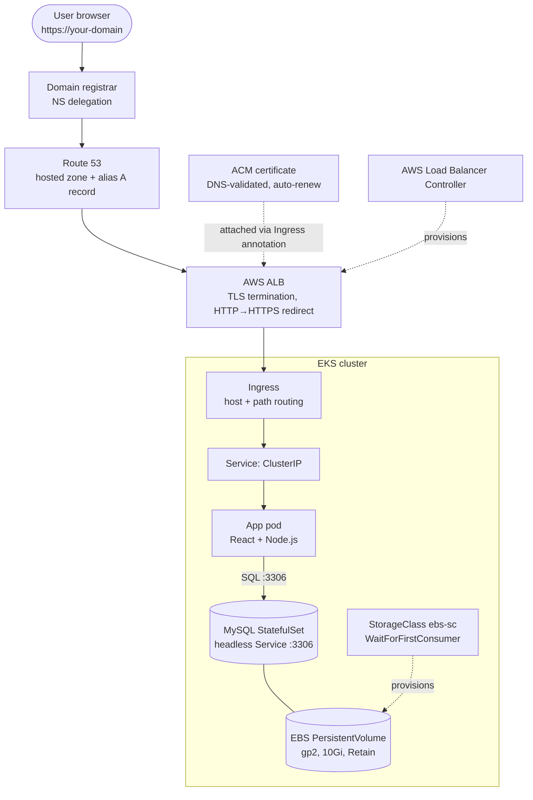
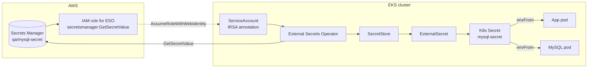
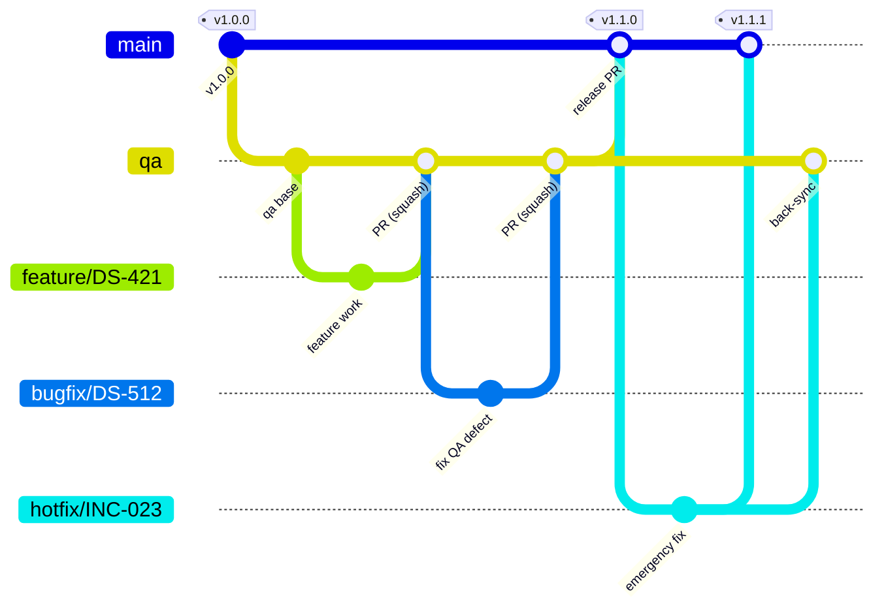
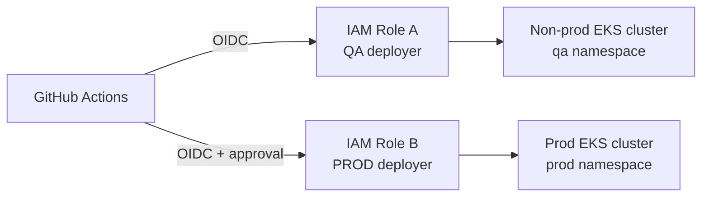

# End-to-End DevSecOps on AWS EKS

A production-grade DevSecOps project: a 3-tier Node.js application deployed to **AWS EKS** via **GitHub Actions**, with security scanning built into every pipeline, secretless AWS authentication, managed secrets, HTTPS routing, and full observability.

> **Status:** Application code and initial Kubernetes manifests are in place. CI/CD workflows, infrastructure code, MySQL manifests, secrets integration and observability are still to be built.

## What You'll Build

- End-to-end CI/CD with GitHub Actions and branch-based promotion: `feature/*` → `qa` → `main`
- DevSecOps tooling in the pipelines: **Gitleaks**, **Trivy**, **Checkov**, **SBOM**, **SonarQube**
- Secretless AWS auth via **GitHub OIDC** (no static credentials) with secure EKS access
- Secrets management with **AWS Secrets Manager**, **External Secrets Operator**, and **IRSA**
- Stateful **MySQL** on Kubernetes using StatefulSets, Services, and persistent EBS storage
- Production-grade **EKS** architecture with **ALB**, **Route 53**, and **ACM** for HTTPS
- Observability with **Prometheus, Loki, Tempo, and Grafana** (metrics, logs, traces)
- Custom domain with ACM-issued TLS certificates wired into the Kubernetes Ingress

## The Application

A simple User Management app (Add / View / Edit / Delete users) serves as a placeholder workload to exercise the platform. It will later be replaced by an AI-based project (TBD), so the pipelines and manifests are designed to stay app-agnostic.

| Tier | Technology |
|------|------------|
| Frontend | React 17, Webpack 5, Axios |
| Backend | Node.js 20, Express 4, `mysql2` (REST API, port 5000) |
| Database | MySQL 8.0 |

API: `GET /api/users`, `POST /api/users`, `PUT /api/users/:id`, `DELETE /api/users/:id`.

## Architecture

### Request flow and workloads



### Secrets management



### Observability


## Branching Strategy



| Branch | Created from | Merged into | Environment |
|--------|--------------|-------------|-------------|
| `main` | permanent | n/a | Production |
| `qa` | `main` | `main` | QA |
| `feature/*` | `qa` | `qa` | pre-merge |
| `bugfix/*` | `qa` | `qa` | QA |
| `hotfix/*` | `main` | `main` + `qa` | Production (emergency) |

Naming: `<type>/<ticket-id>-<short-slug>` in lowercase with hyphens; releases are tagged `vMAJOR.MINOR.PATCH`.

## CI/CD Pipelines

### QA pipeline (on merge to `qa`)


### Production pipeline (on merge to `main`)


Images live in a private Amazon ECR repository in the same region as EKS. QA builds are tagged with the git SHA; promotion retags the same image as `prod-<sha>` (no rebuild, no rescan).

Principles: security at every stage, **build once / promote the artifact**, immutable SHA-tagged images, parallel jobs for speed, controlled human-approved promotion.

## Environments and Access

Two environments: a non-prod EKS cluster running the `qa` namespace and a separate dedicated prod cluster running the `prod` namespace. All resources live in `ap-south-1`. Disaster recovery is provisioned on demand from IaC rather than kept running.



The QA and prod pipelines never share an IAM role.

## Extending to More Environments (dev, ppd)

Only `qa` and `prod` are in scope today. The pipelines are meant to be driven by per-environment configuration so adding `dev` or `ppd` does not require restructuring:

1. **Namespace and manifests:** copy `k8-manifests/qa/` to `k8-manifests/<env>/` and adjust namespace, replicas, resources, host and cert ARN.
2. **Environment config:** add the environment's values (namespace, cluster name, IAM role ARN, host, ACM cert ARN, ECR repo) as GitHub Environment variables, or as a matrix entry in the workflow, instead of hardcoding them.
3. **Branch mapping:** decide which branch deploys to it (for example `feature/*` to `dev`, `qa` to `qa`, a pre-merge state of `main` to `ppd`) and add that trigger to the workflow's environment matrix.
4. **AWS access:** extend the non-prod IAM deployer role's trust policy and namespace permissions to include the new namespace. Never give it access to `prod`.
5. **Cluster add-ons:** create the namespace with its resource quota and network policies, plus its own SecretStore/ExternalSecret and Secrets Manager entry (`<env>/mysql-secret`).
6. **DNS/TLS:** add a `<env>.<domain>` record in Route 53 and issue or reuse an ACM certificate.
7. **Approvals:** add a GitHub Environment with the required reviewers if the environment should be gated.

## Repository Layout

```
client/                 React frontend (Webpack build)
server/                 Node.js + Express backend (config, models, controllers, routes)
Dockerfile              Builds client, bundles into server image; runs as non-root
sonar-project.properties SonarQube project config
k8-manifests/
  qa/                   App Deployment, Service, Ingress (qa namespace)
  prod/                 Same for prod namespace
.github/workflows/      (planned) QA and prod pipelines
terraform/              (planned) AWS infrastructure
```

## Local Development

```bash
# Backend (needs a reachable MySQL)
cd server && npm install && npm start      # http://localhost:5000

# Frontend bundle
cd client && npm install && npm run build
```

Backend environment variables: `PORT`, `DB_HOST`, `DB_USER`, `DB_PASSWORD`, `DB_NAME`.

Container image:

```bash
docker build -t nodejs-app .
docker run -p 5000:5000 -e DB_HOST=<mysql-host> -e DB_USER=<user> -e DB_PASSWORD=<password> -e DB_NAME=<db> nodejs-app
```

## Prerequisites

AWS account (region `ap-south-1`), a registered domain, GitHub repository, Docker, `kubectl`, `awscli`, Terraform (if used), and a SonarQube instance or SonarCloud project.
