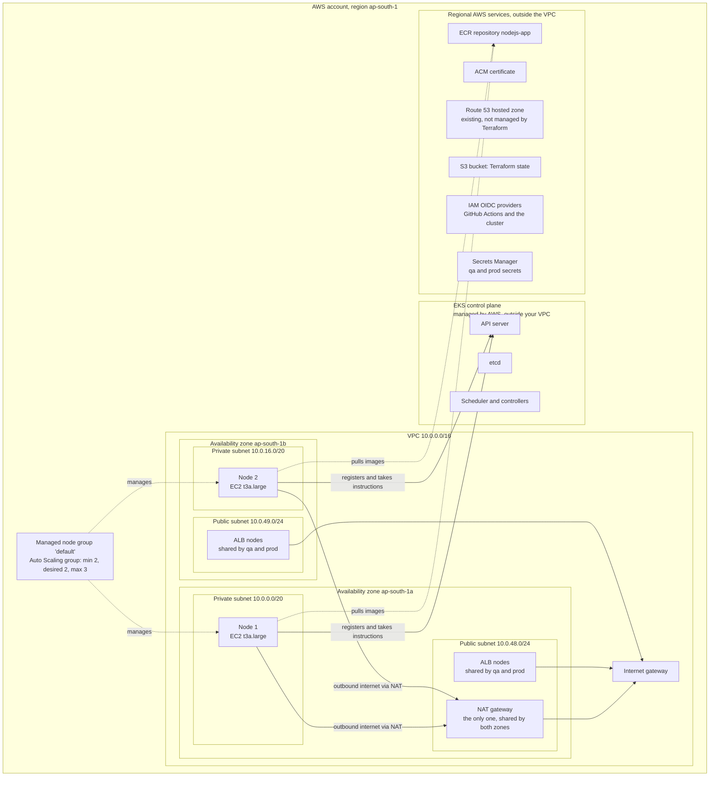
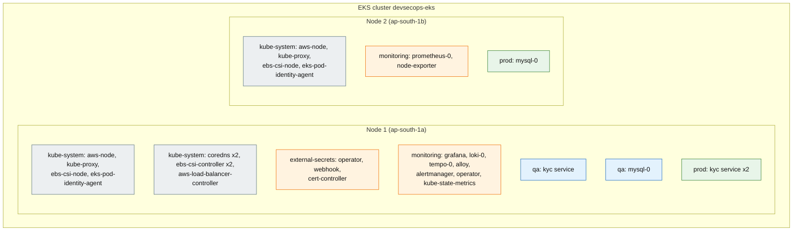

# The EKS infrastructure, explained

Three views of the same system, as it runs today: the AWS layout built by the `platform` stack, the pods on the nodes, and commands to look at it yourself. Pod placement in view 2 is illustrative, because Kubernetes decides where each pod runs.

## Key terms

| Term | What it is | In this project |
|------|------------|-----------------|
| **EKS control plane** | The Kubernetes "brain" (API server, etcd, scheduler). Run and patched by AWS, in an AWS-owned network, not inside your VPC. You never see its servers. | One control plane for the cluster `devsecops-eks` |
| **Node** | One EC2 virtual machine that runs your containers. Billed as a normal EC2 instance. | 2 nodes, type `t3a.large`, one per availability zone |
| **Managed node group** | A named set of identical nodes managed by AWS through an Auto Scaling group. It keeps the count between a minimum and a maximum and replaces failed nodes. It is a grouping, not a separate machine. | One group, `default-...`: min 2, desired 2, max 3 |
| **Pod** | The smallest unit Kubernetes runs: one or more containers sharing a network address. Every pod runs on exactly one node. | System pods, the KYC service, MySQL, the observability stack |
| **Namespace** | A logical folder inside the cluster used to separate and name things (and to apply permissions and quotas). It is **not** a machine or a network. A namespace's pods can run on any node, and one node runs pods from many namespaces. | `kube-system`, `external-secrets`, `monitoring`, `qa`, `prod` |
| **DaemonSet** | A pod definition that Kubernetes runs once on every node. | `aws-node`, `kube-proxy`, `ebs-csi-node`, `eks-pod-identity-agent` |
| **Deployment** | A pod definition that Kubernetes runs N times and spreads across nodes as it sees fit. | `coredns` (2), `ebs-csi-controller` (2), the KYC service (1 in qa, 2 in prod) |

The one idea that resolves most confusion: **nodes are the physical layer, namespaces are the logical layer, and pods are the things that sit in both.** Every pod belongs to exactly one namespace and runs on exactly one node.

## View 1: AWS layout (what was built)



Reading it:
- The **control plane** sits outside your VPC. Nodes reach it over the network and register themselves.
- The **nodes** are in **private** subnets, so they have no public IP. They reach the internet (to pull images and call AWS APIs) through the single **NAT gateway**, which lives in a public subnet.
- The **ALB** (created by the AWS Load Balancer Controller from the Ingresses) goes in the **public** subnets and is the only thing the internet talks to.
- The **node group** is not a place. It is the rule that keeps the two nodes alive and replaces them if one fails.
- There is only one NAT gateway, so if zone `ap-south-1a` fails, the nodes in `ap-south-1b` lose outbound internet. This is the cost trade-off we accepted.

## View 2: pods on nodes (logical and physical together)

Colour shows the namespace. This is an illustrative snapshot: the scheduler placed most pods on one node when this was taken.



Reading it:
- The **DaemonSet** pods (`aws-node`, `kube-proxy`, `ebs-csi-node`, `eks-pod-identity-agent`) run once on **every** node. That is why you see each of them twice.
- The **Deployment** pods (`coredns`, `ebs-csi-controller`, the KYC service) are spread across nodes by the Kubernetes scheduler. Where each one lands in this picture is illustrative: Kubernetes decides, and may move a pod to another node if a node fails.
- The `qa` and `prod` namespaces share the same two nodes. They are separated by namespace rules (permissions and quotas), not by separate machines. There are no NetworkPolicies yet (see [security gates](security-gates.md)). This is the cost trade-off of a single cluster.
- Each MySQL pod gets its own EBS volume, which lives in one availability zone. If that pod is rescheduled it must land on a node in the same zone as its volume.

## View 3: look at it yourself

```bash
kubectl get nodes -o wide          # the 2 nodes: zone, IP, version
kubectl get ns                     # the namespaces (logical folders)
kubectl get pods -A -o wide        # every pod, its namespace, and the NODE it runs on
kubectl get pods -A -o wide --field-selector spec.nodeName=<node-name>   # pods on one node
```

In the last pod listing, the `NAMESPACE` column is the logical view and the `NODE` column is the physical view of the same pods.

Back to the [documentation index](README.md).
